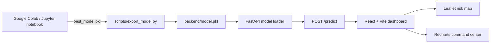

# TerraWatch: AI-Powered Landslide Risk Prediction and Early Warning System

A Smart India Hackathon command center for landslide monitoring across Northeast India. The notebook remains the source of truth for training. The FastAPI service only loads the exported artifact and performs inference; it never retrains a model.

## Architecture



## Project layout

- `Untitled0 (1).ipynb`: completed training and explainability workflow.
- `backend/`: FastAPI API, model loading, feature adapter, schemas, and configuration.
- `frontend/`: Vite React dashboard with live Axios inference, Leaflet, Heroicons, and Recharts.
- `scripts/export_model.py`: copies the notebook artifact to the deployment location.
- `scripts/verify_model.py`: validates the artifact and executes a sample prediction.

## 1. Export the trained model

The notebook currently saves `best_model.pkl` in its working directory. Execute the training and model-selection cells, then from the repository root run:

```powershell
python scripts/export_model.py
python scripts/verify_model.py
```

The export script also accepts an existing `model.pkl` and places the canonical deployment copy at `backend/model.pkl`. The API intentionally starts in a degraded state with HTTP 503 predictions when this artifact is absent.

## 2. Run the backend

```powershell
cd .
python -m venv .venv
.\.venv\Scripts\Activate.ps1
pip install -r backend/requirements.txt
uvicorn backend.main:app --reload --host 0.0.0.0 --port 8000
```

Endpoints:

- `GET /` service identity
- `GET /health` readiness and model status
- `GET /model-info` estimator type and training feature order
- `POST /predict` validated risk inference

Example request:

```json
{"rainfall":450,"slope":35,"soil_moisture":78,"elevation":1200}
```

The predictor reads `feature_names_in_` from the serialized estimator when available. It maps notebook names such as `Rainfall_mm`, `Slope_Angle`, `Soil_Saturation`, and `Elevation` to the dashboard inputs, preserves the trained order, and supplies deterministic zero values for the notebook's binary soil/land-cover columns.

## 3. Run the dashboard

In a second terminal:

```powershell
cd frontend
npm install
npm run dev
```

Open the Vite URL shown in the terminal, normally `http://localhost:5173`. `frontend/.env` points Axios at `http://localhost:8000`; change `VITE_API_URL` for another deployment.

## Risk bands

- Low: score `0-49`
- Medium: score `50-79`
- High: score `80-100`

## Production notes

Use a pinned Python environment, store `model.pkl` in protected artifact storage, terminate TLS at the deployment edge, restrict `ALLOWED_ORIGINS`, and add authentication/rate limiting before exposing the API publicly. The notebook's own warning about potential data leakage should be resolved with a leakage-safe holdout before operational deployment.
